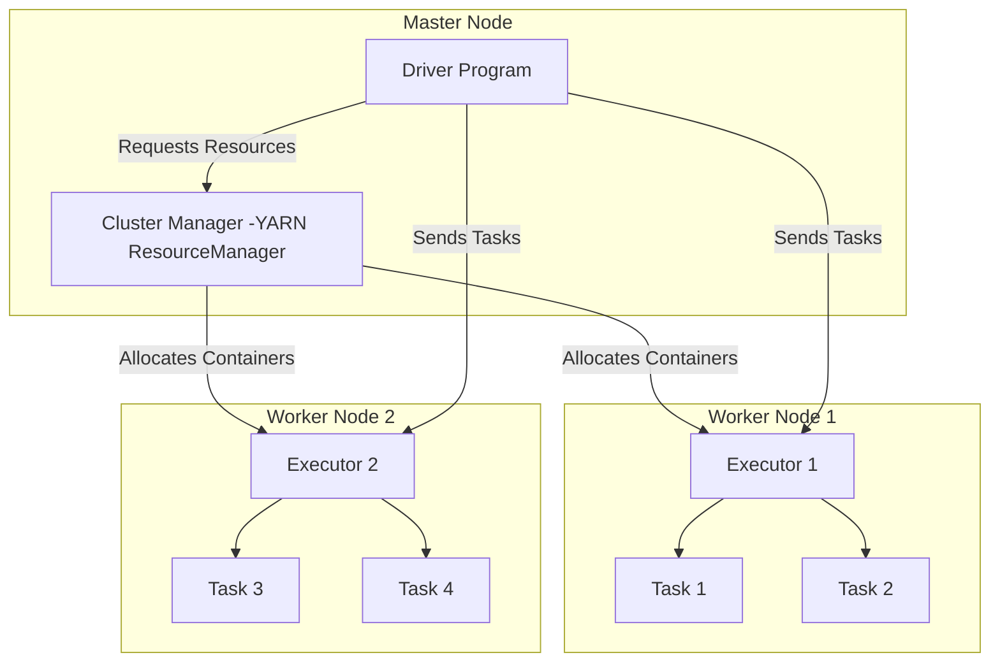
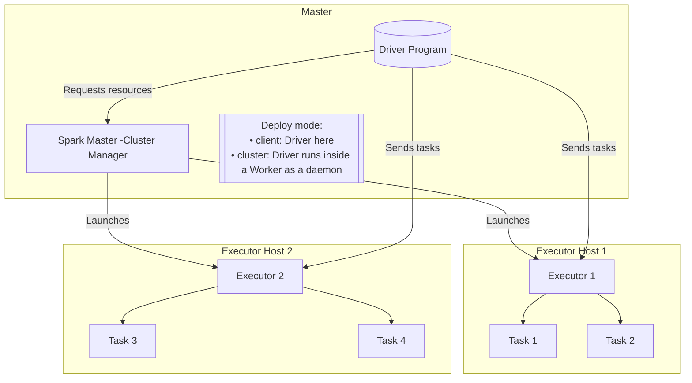
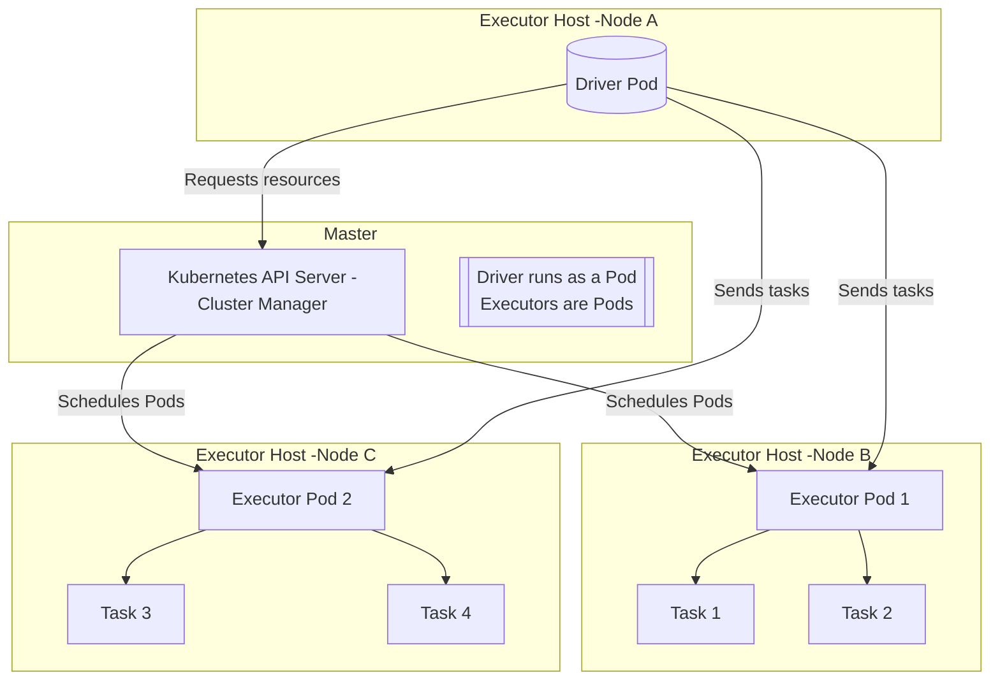

```mermaid
flowchart TB
subgraph MasterNode[Master Node]
RM[Cluster Manager -YARN ResourceManager]
Driver[Driver Program]
end

    subgraph CoreNode1[Worker Node 1]
        Exec1[Executor 1]
        Task1a[Task 1]
        Task1b[Task 2]
    end

    subgraph CoreNode2[Worker Node 2]
        Exec2[Executor 2]
        Task2a[Task 3]
        Task2b[Task 4]
    end

    Driver -->|Requests Resources| RM
    RM -->|Allocates Containers| Exec1
    RM -->|Allocates Containers| Exec2
    Driver -->|Sends Tasks| Exec1
    Driver -->|Sends Tasks| Exec2
    Exec1 --> Task1a
    Exec1 --> Task1b
    Exec2 --> Task2a
    Exec2 --> Task2b
```

Stand Alone

```mermaid
flowchart TB
subgraph MasterNode[Master]
SM[Spark Master -Cluster Manager]
Driver[(Driver Program)]
note1[[Deploy mode:\n• client: Driver here\n• cluster: Driver runs inside a Worker as a daemon]]
end

    subgraph Worker1[Executor Host 1]
        Exec1[Executor 1]
        T1a[Task 1]
        T1b[Task 2]
    end

    subgraph Worker2[Executor Host 2]
        Exec2[Executor 2]
        T2a[Task 3]
        T2b[Task 4]
    end

    Driver -->|Requests resources| SM
    SM -->|Launches| Exec1
    SM -->|Launches| Exec2
    Driver -->|Sends tasks| Exec1
    Driver -->|Sends tasks| Exec2
    Exec1 --> T1a
    Exec1 --> T1b
    Exec2 --> T2a
    Exec2 --> T2b
```

Spark - K8s

```mermaid
flowchart TB
    subgraph ControlPlane[Master]
        API[Kubernetes API Server -Cluster Manager]
        note2[[Driver runs as a Pod\nExecutors are Pods]]
    end

    subgraph K8sNodeA[Executor Host -Node A]
        DriverPod[(Driver Pod)]
    end

    subgraph K8sNodeB[Executor Host -Node B]
        ExecPod1[Executor Pod 1]
        TK1a[Task 1]
        TK1b[Task 2]
    end

    subgraph K8sNodeC[Executor Host -Node C]
        ExecPod2[Executor Pod 2]
        TK2a[Task 3]
        TK2b[Task 4]
    end

    DriverPod -->|Requests resources| API
    API -->|Schedules Pods| ExecPod1
    API -->|Schedules Pods| ExecPod2
    DriverPod -->|Sends tasks| ExecPod1
    DriverPod -->|Sends tasks| ExecPod2
    ExecPod1 --> TK1a
    ExecPod1 --> TK1b
    ExecPod2 --> TK2a
    ExecPod2 --> TK2b
```