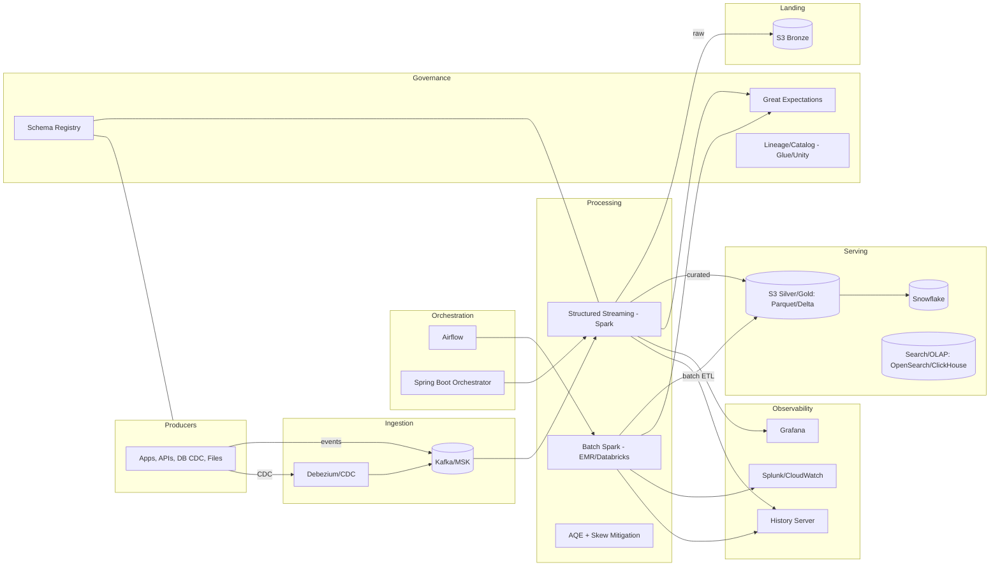

```mermaid
flowchart LR
subgraph Producers
A[Apps, APIs, DB CDC, Files]
end
subgraph Ingestion
K[(Kafka/MSK)]
DBCDC[Debezium/CDC]
end
subgraph Landing
S3B[(S3 Bronze)]
end
subgraph Processing
SS[Structured Streaming - Spark]
B[Batch Spark - EMR/Databricks]
QE[AQE + Skew Mitigation]
end
subgraph Serving
S3S[(S3 Silver/Gold: Parquet/Delta)]
SNF[(Snowflake)]
ES[(Search/OLAP: OpenSearch/ClickHouse)]
end
subgraph Orchestration
AF[Airflow]
SB[Spring Boot Orchestrator]
end
subgraph Governance
SR[Schema Registry]
DQ[Great Expectations]
LG[Lineage/Catalog - Glue/Unity]
end
subgraph Observability
G[Grafana]
SP[Splunk/CloudWatch]
HS[History Server]
end

A -->|events| K
A -->|CDC| DBCDC --> K
K --> SS
SS -->|raw| S3B
SS -->|curated| S3S
B -->|batch ETL| S3S
S3S --> SNF
AF --> B
SB --> SS
SS --> DQ
B --> DQ
SS --> G
B --> SP
SS --> HS
B --> HS
SR --- SS
SR --- Producers
```